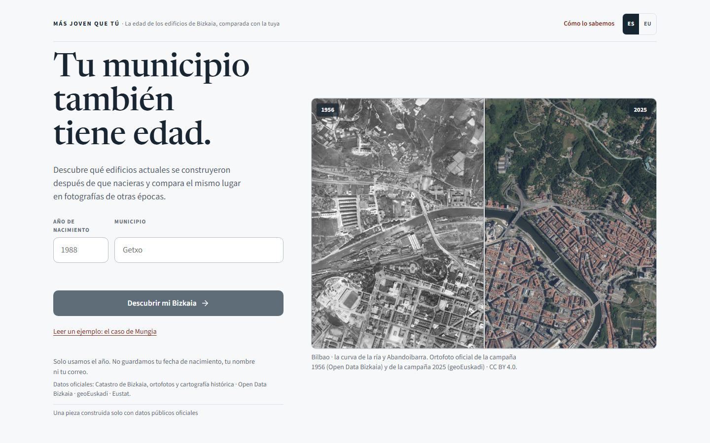
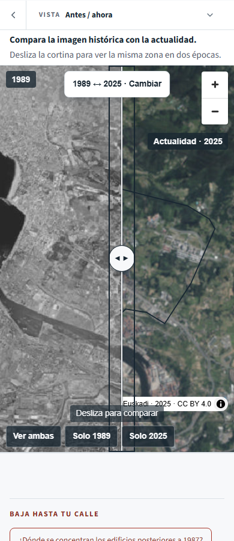

# Revisión de preparación — 28 septiembre 2026

**Veredicto: buena base para presentar, entrega aún no cerrada.** Se han comprobado
datos, código, cinco modos del visor, accesibilidad automática, navegación y fallos
simulados. No se ha publicado este candidato ni probado un VPS. No se puede deducir
una probabilidad de ganar de los tests ni de los premios de otra edición.

Revisión secuencial, sin subagentes. Fuente inicial: HEAD
`ef4889d228d1039ae4dbe02fef6eb47d46d39f2e`; cambios locales de esta revisión sin commit.
Evidencia nueva: [carpeta de ejecución](../evidence/readiness-20260928/).
Los informes anteriores no se consideran pruebas de este candidato.

## Correcciones realizadas

- **Dominio configurable:** `SITE_URL` actualiza portada, metodología, canonical,
  Open Graph/Twitter, robots y sitemap. Se valida HTTPS y coherencia con `BASE_PATH`.
  Test nuevo con dominio raíz, subruta, repetición y entradas inválidas.
- **Evolución a 320 px:** las décadas se solapaban bajo el deslizador. Se ocultan
  etiquetas auxiliares cuando el carril útil mide ≤120 px. Se conserva el año activo,
  los pasos anuales y la semántica accesible. No cambian métricas ni reproducción.
- **Test de navegación estable:** el redimensionado consumía tiempo real adicional
  y producía un falso salto 1956→1960. Se controla el reloj antes de reproducir,
  manteniendo los umbrales originales. Pasa continuidad, pausa, foco y movimiento
  reducido. El log del fallo original se conserva.
- **Preparación VPS:** [Caddyfile](../deploy/Caddyfile) y
  [procedimiento](VPS_DEPLOYMENT.md), con caché, rutas, datos fuera de Git y rollback.
  Plantilla sin validar en servidor real; no equivale a despliegue.

## Evidencia técnica

| Comprobación | Resultado y límites |
| --- | --- |
| Python, datos | 49/49 tests; no se ha repetido toda la ingesta de 112 municipios |
| Vitest | 279/279 tests de aplicación |
| Servidor/raster | 17/17 tests; incluye Range y rechazo de muestras uniformes |
| SEO configurable | 1 test adicional con varios escenarios, aprobado |
| Svelte / lint | Sin errores; 2 avisos Svelte de valor inicial y 5 avisos preexistentes de variables sin uso en scripts |
| Build | Compilación estática aprobada. Un intento simultáneo dio EPERM; no fue defecto del producto y se conserva su log |
| Dependencias | `npm audit`: 0 vulnerabilidades informadas; no sustituye a una auditoría de seguridad |
| Chromium 153 | Smoke completo con servicios reales, contenido de ortofoto y cambio Leioa→Getxo: PASS |
| WebKit 26.6 | Mismo smoke: PASS. No es Safari en iPhone físico |
| Firefox 155 | FAIL/INCONCLUSO: el mapa no aparece en el smoke; después se bloquea la captura. Sonda aislada detecta WebGL2, pero no termina el recorrido en 35 s. Causa sin determinar; no atribuir automáticamente a drivers ni a la app |
| Responsive / axe | 24 estados: 8 pasos × 1440/390/320 px; 0 desbordamientos, 0 pageerrors, 0 infracciones WCAG A/AA detectadas por axe |
| Interacciones | Formularios, cambios/cancelaciones, enlaces profundos, atrás/adelante, reproducción, foco ES/EU y movimiento reducido: PASS con fixtures declaradas |
| Cortina | Flecha derecha cambia aria-valuenow en los tres tamaños; imágenes inspeccionadas |
| Espaciado de texto | Sobrescrituras WCAG 1.4.12 del smoke: PASS |
| Controles negativos | CTA ausente, cambio de lugar inoperante, raster bloqueado y métricas bloqueadas: los 4 provocan FAIL; corrida normal posterior PASS |
| Android / Maestro | Comprobado posteriormente con Maestro 2.10.0, AVD Android 13 y Chrome 109. Corregido buscador tapado por teclado; 5/5 comprobaciones de contenido mediante CDP en Android. Flows, capturas y límites en [ANDROID_MAESTRO_20260928.md](ANDROID_MAESTRO_20260928.md) |
| VPS / DNS / TLS | Pendiente: no hay dominio ni destino suministrado, ni Caddy disponible para validar localmente |

Los JSON de `launch-chromium/`, `launch-webkit/`, `faults/`, `visual-a11y.json`,
`engine-probe.json` y `npm-audit.json` contienen el detalle. Logs locales en la misma
carpeta (el repositorio ignora `*.log`). Las pruebas automáticas no acreditan lectores
de pantalla, zoom real, naturalidad del euskera ni comprensión por personas nuevas.

## Recorrido visual

| Paso | Estado | Hallazgo |
| --- | --- | --- |
| 1. Portada | Bien | Pregunta comprensible, fuente y ejemplo sin formulario disponibles |
| 2. Año/municipio → resultado | Funciona; mejorable en móvil | Numerador, denominador y cobertura visibles; el bloque editorial desplaza el mapa hacia abajo |
| 3. Evolución | Corregido | Solapamiento de décadas en carril estrecho; controles siguen operables |
| 4. Fotos aéreas | Bien en muestras probadas | Contenido real, campaña 1989 y atribución visibles |
| 5. Antes/ahora | Bien, con densidad visual | Cortina operable; a 320 px se acumulan chips, atribución y presets sobre la imagen |
| 6. Mapa 1923–25 | Bien en muestras probadas | Cartografía con contenido y distinción explícita respecto a fotografía |
| 7. Cómo lo sabemos | Bien | Caso 60/70, contratos, fuentes, límites y acceso al CSV |
| 8. Ejemplo Mungia | Bien | 85,7 % de recuento frente a 1,9 % de huella; síntesis y límites próximos |

Capturas de escritorio y móvil guardadas con prefijos `1440-`, `390-`, `320-`.
Se inspeccionó contenido de los mapas e imágenes; un canvas o HTTP 200 por sí solo
no basta. La captura histórica previa a la corrección queda como
`320-evolution-before.png`. No se certifican todas las campañas ni todas las zonas.

## Bases y comparación con referencias

Se descargó otra vez el [documento oficial BDNS 1512073](https://www.infosubvenciones.es/bdnstrans/api/convocatorias/documentos?idDocumento=1512073&vpd=GE).
SHA-256: `f734947952a72eaa636f760969b39926be385b8bd397e50fb98470f326818fe4`,
idéntico al documento archivado. Esta comprobación no descarta nuevas correcciones
publicadas fuera de esa URL. La ficha del procedimiento no fue accesible mediante
el buscador en esta ejecución; verificar vigencia y plazo en sede antes de presentar.

La rúbrica de Visualización del documento asigna 25 % a dinamismo, 25 % a comprensión,
25 % a rigor, 15 % a innovación y 10 % a diseño/usabilidad. La Base 6 pide documentar
procedencia/acceso, proceso y herramientas. La Base 18 mantiene responsabilidad por
material de terceros. No se ha incorporado código, imágenes ni textos de referentes
al producto. Las capturas de referencia son evidencia de revisión.

Se abrió el [catálogo oficial](https://www.opendatabizkaia.eus/es/visualizacion), la
entrada de [Bizkaia Pedalea](https://tecnoperiodismo.neocities.org/opendatabizkaia) y
[IGN Remonter le temps](https://remonterletemps.ign.fr/). Se consultó documentación
primaria de [Swisstopo](https://www.swisstopo.admin.ch/en/a-journey-through-time-maps).
Esto es una comparación acotada, no una auditoría completa de esos productos ni de
todas las candidaturas. La primera captura de Pedalea muestra una animación de
entrada incompleta: no se usa para juzgar su diseño final.

| Patrón de referencia | Situación aquí | Prioridad |
| --- | --- | --- |
| IGN: comparar épocas y localizar un lugar desde una entrada clara | Ya hay búsqueda, campañas y cortina; falta reducir el esfuerzo de llegar al mapa en móvil | P1 |
| Pedalea: tema público y recorrido Inicio/Mapa/Rutas/Datos/Fin reconocibles en el texto consultado | El ejemplo y la síntesis ya existen; demostrar primero el hallazgo en la presentación | P1 editorial |
| Swisstopo: cartografía/fotografía temporal explicada | Ya se diferencian modos y campaña/vuelo; conservar esta honestidad | Mantener |
| Catálogo oficial: diversidad de formatos y preguntas | La oportunidad no es añadir más capas; es hacer memorable y comprobable la pregunta sobre el parque actual | Mantener foco |

## Prioridad antes de entregar

1. **P0 — cerrar Firefox:** reproducir en Firefox de escritorio visible, guardar
   errores/estado y resolver la causa o declarar el límite. No usar el PASS histórico
   de `LAUNCH_QUALITY.md` como certificación actual.
2. **P0 — ensayo de publicación:** elegir dominio/VPS, build con SITE_URL real,
   subir todos los PMTiles y JSON, probar HTTPS, Range, ambas rutas y rollback.
   Regenerar paquete/manifiesto/capturas contra ese candidato, no el anterior.
3. **P0 de entrega — revisión humana:** elegibilidad y solicitud por canal oficial,
   memoria y fuentes adjuntas; confirmar plazo vigente. Prueba de móvil físico,
   NVDA/Safari y revisión EU según la checklist existente.
4. **P1 — primera sesión móvil:** observar a personas nuevas intentando explicar
   qué mide el dato y llegar al mapa. Evaluar mover el recuadro Mungia después del
   primer mapa conservando cobertura y límites junto a la cifra. Es propuesta,
   no cambio aplicado ni mejora de conversión medida.
5. **P1 — presentación:** abrir por el contraste verificable 60/70 y 1,9 %, seguir
   con el año propio y comparación visual, cerrar con fuente/límites. La demo de
   respaldo complementa la visualización; no convertir la candidatura en audiovisual.

No se proponen backend, IA, cuentas, rankings ni nuevos datasets: no hay una necesidad
demostrada para esos añadidos. El mayor margen inmediato está en comprensión inicial,
compatibilidad y fiabilidad de la entrega.
